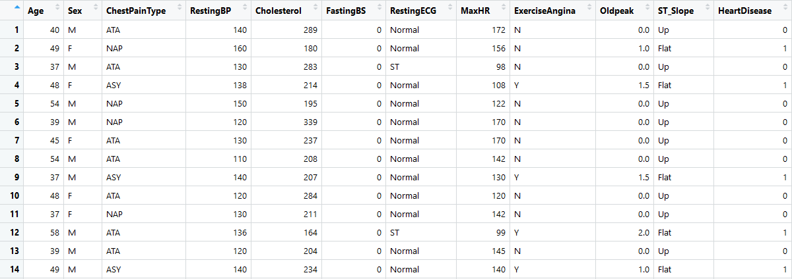
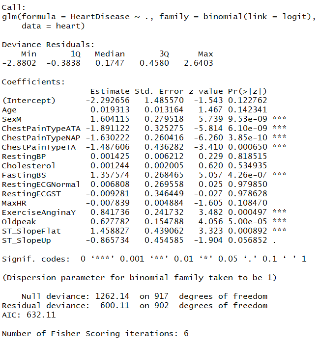
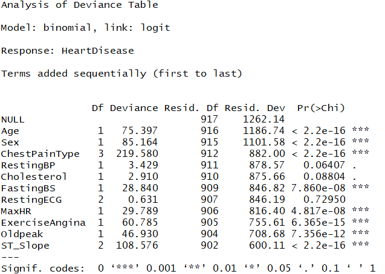

# Heart Failure Prediction

## Introduction

Heart failure is a common event caused by CVDs and this dataset contains 12 features that can be used to predict mortality by heart failure.

Most cardiovascular diseases can be prevented by addressing behavioural risk factors such as tobacco use, unhealthy diet and obesity, physical inactivity and harmful use of alcohol using population-wide strategies.

People with cardiovascular disease or who are at high cardiovascular risk (due to the presence of one or more risk factors such as hypertension, diabetes, hyperlipidaemia or already established disease) need early detection and management using counselling and medicines, as appropriate.

## Dataset

The [dataset](https://www.kaggle.com/datasets/fedesoriano/heart-failure-prediction) used is taken from kaggle and counts 918 observations with 12 features related to each observation.

Some of the data distribution shown unreasonable valuse which must be corrected before training the model.

## Data Processing

Some statistical analysis was performed to find the outliers and correct them. The outliers were corrected by replacing them with the mean of the column. Moreover the correlation between variables was also checked to find the most important features, using Pearson Chi Square test:

For the non categorical variables, the correlation was checked using the Weltch two sample t-test:

## Models

After the tests the most relevant variables seems to be:
- Sex;
- ChestPainType;
- MaxHR;
- ST slope.

To prove the results of the statistichs 2 models are used for the prediction.

### Logistic Regression

The logistic regression confirmed the relevance of some variables found with the statistical analysis:
- Sex
- ChestPainType
- FastingBS
- Exercise Angina

But it also found that the other variables are not relevant for the prediction.

- Oldpeak is significant (low tails masked it before)
- MaxHR is not so relevant (the difference in the means are not so important to the model)

### ANOVA
  

The differences between the null deviance and residual deviance shows how our model perform against null hypothesis.

The difference drops at each variable addiction meaning that it is significant for the model.

## Bugs and feature requests

Have a bug or a feature request? Please first read and search for existing and closed issues. If your problem or idea is not addressed yet, [please open a new issue](https://github.com/Torbidos7/heart_failure/issues/new).
## Authors

- [@Torbidos7](https://github.com/Torbidos7)

## Thanks

Thank you for coming :stuck_out_tongue_closed_eyes:

## Copyright and license

Code and documentation copyright 2011-2018 the authors. Code released under the [MIT License](https://github.com/Torbidos7/heart_failure/blob/master/LICENSE).

